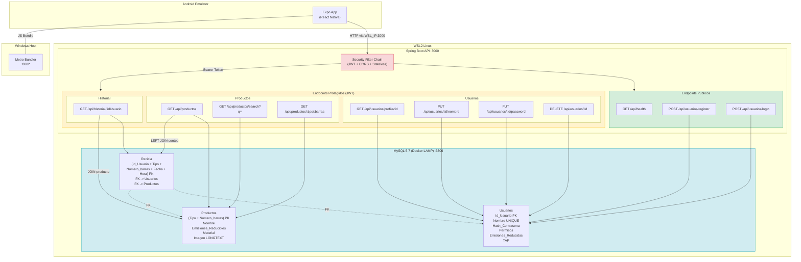
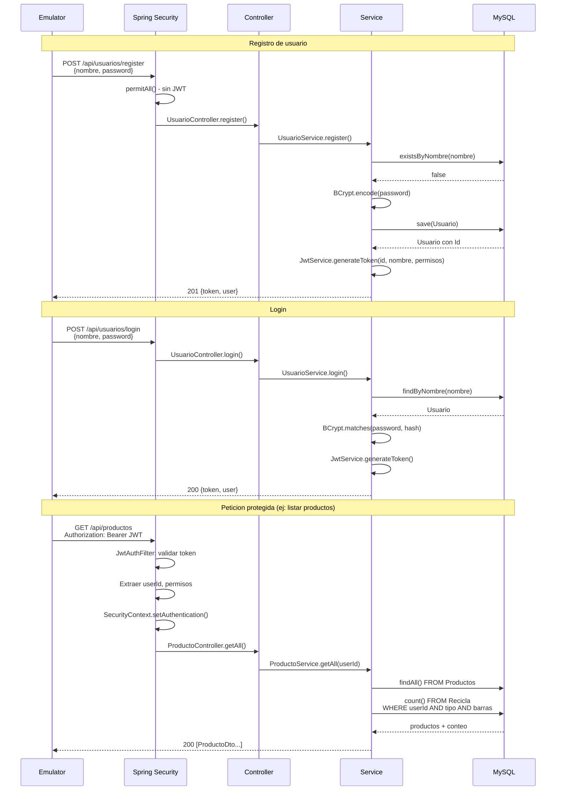

# Diagrama de la API ReciApp

## Arquitectura General



## Flujo de Autenticacion



## Modelo de Datos

```mermaid
erDiagram
    Usuarios {
        INT Id_Usuario PK "AUTO_INCREMENT"
        VARCHAR50 Nombre UK "NOT NULL"
        VARCHAR100 Hash_Contrasena "NOT NULL, BCrypt"
        VARCHAR15 Permisos "cliente | administrador"
        FLOAT Emisiones_Reducidas "Default 0"
        INT TAP "Nullable"
    }

    Productos {
        VARCHAR10 Tipo PK "EAN13, UPC, etc."
        BIGINT Numero_barras PK
        VARCHAR50 Nombre
        FLOAT Emisiones_Reducibles "kg CO2"
        VARCHAR15 Material "PET, Vidrio, Aluminio..."
        LONGTEXT Imagen "Base64"
    }

    Recicla {
        INT Id_Usuario PK_FK
        VARCHAR10 Tipo PK_FK
        BIGINT Numero_barras PK_FK
        DATE Fecha PK
        TIME Hora PK
    }

    Usuarios ||--o{ Recicla : "recicla"
    Productos ||--o{ Recicla : "es reciclado"
```
