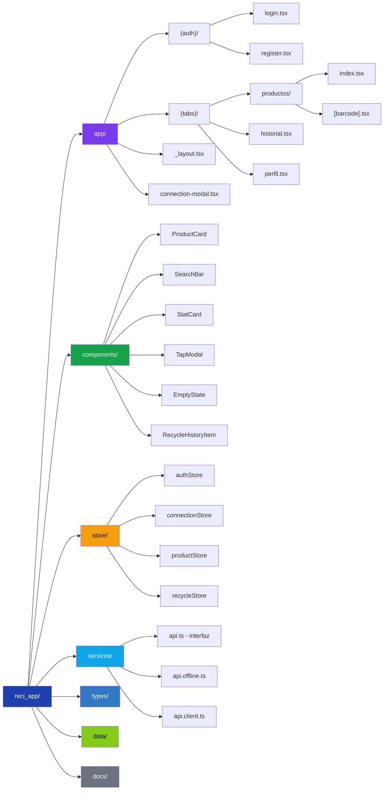
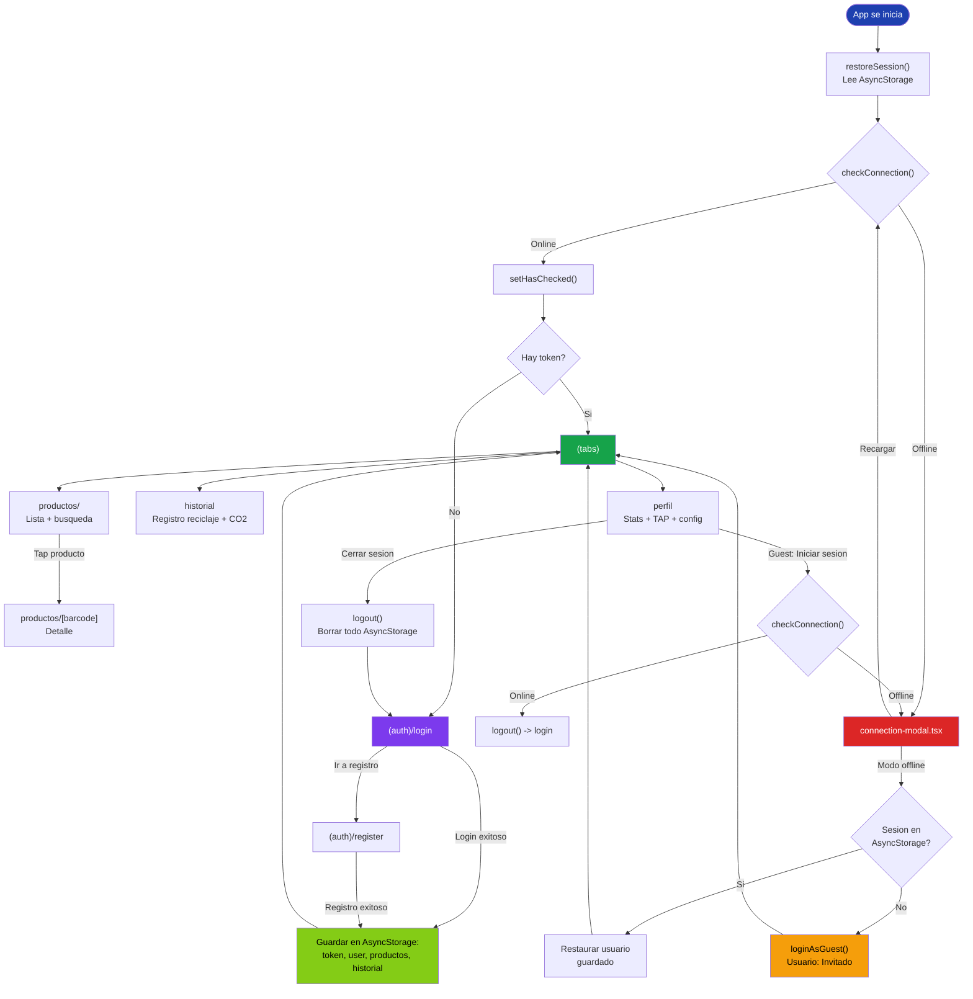

# Estructura de la App - ReciApp

## Arbol de carpetas

## Flujo de navegacion

## Archivos clave

### `app/_layout.tsx`
- Auth guard: redirige segun token
- Comprueba conexion al montar
- Muestra connection-modal si offline

### `store/authStore.ts`
- `login()` / `register()`: autenticacion + pre-cacheo de productos/historial
- `loginAsGuest()`: sesion temporal sin persistir
- `restoreSession()`: lee AsyncStorage, retorna boolean
- `logout()`: borra TODAS las claves con `multiRemove()`

### `services/api.ts`
- Interfaz `ApiService` con todos los metodos
- `OfflineApiService`: datos mock con delays simulados
- `RealApiService`: stub listo para backend Express + MySQL

### `store/connectionStore.ts`
- `isOnline`: estado de conexion
- `hasChecked`: evita re-chequeo tras el modal

### `components/TapModal.tsx`
- Modal para consultar TAP
- 3 estados: guest (no disponible), sin TAP guardado, TAP visible
