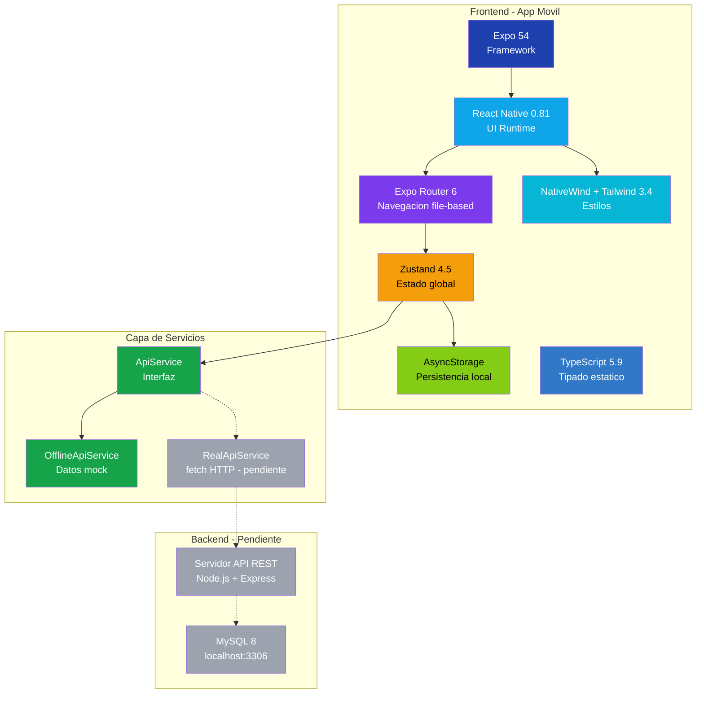

# Stack Tecnologico - ReciApp

## Dependencias principales

| Categoria | Tecnologia | Version | Uso |
|-----------|-----------|---------|-----|
| Framework | Expo | 54.0.0 | Plataforma de desarrollo |
| UI | React Native | 0.81.5 | Renderizado nativo |
| Navegacion | Expo Router | 6.0.10 | Rutas file-based |
| Estilos | NativeWind + Tailwind | latest + 3.4.0 | Utilidades CSS |
| Estado | Zustand | 4.5.1 | State management |
| Persistencia | AsyncStorage | 2.1.2 | Cache local |
| Iconos | @expo/vector-icons | 14 | Ionicons |
| Lenguaje | TypeScript | 5.9.2 | Tipado estatico |
