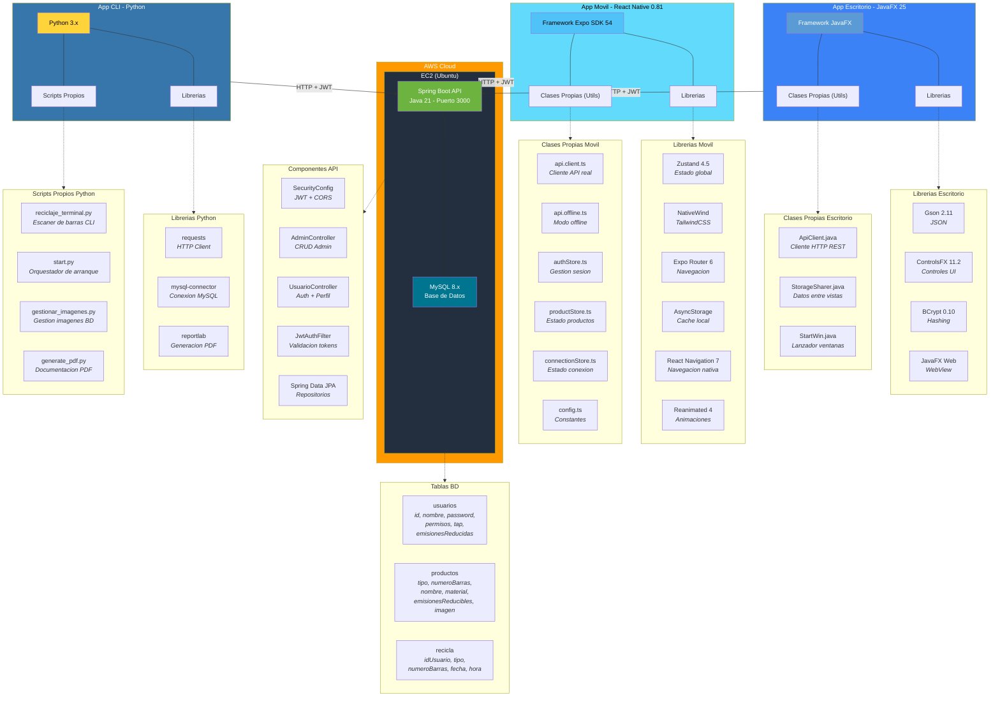
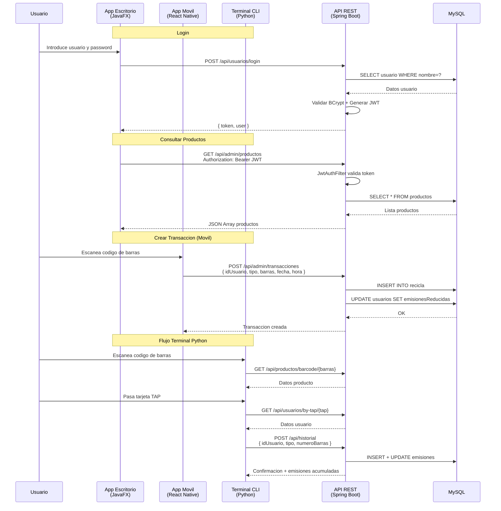
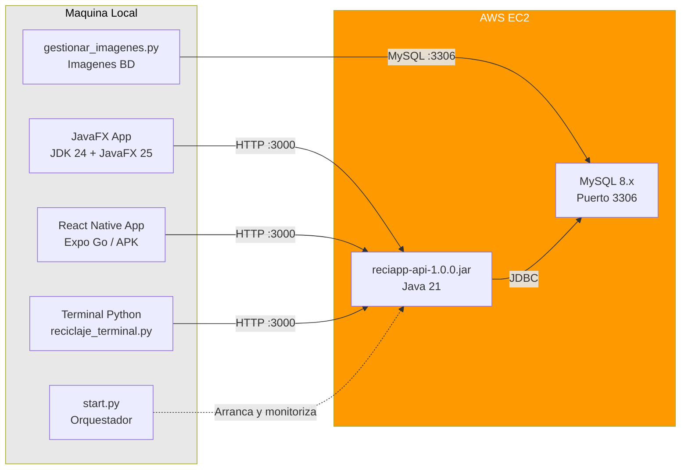
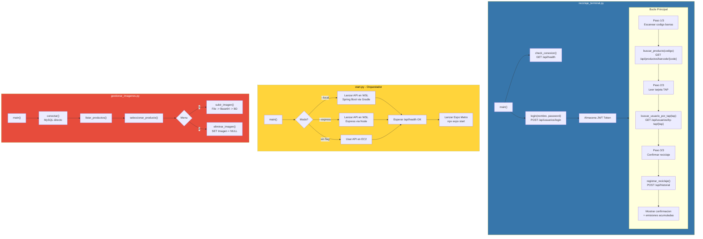

# ReciApp - Diagrama de Arquitectura

## Diagrama General

```mermaid
graph TD
    subgraph AWS["AWS Cloud"]
        subgraph EC2["EC2 (Ubuntu)"]
            API["Spring Boot API<br/>Java 21 - Puerto 3000"]
            API --- BD["MySQL 8.x<br/>Base de Datos"]
        end
    end

    subgraph DESKTOP["App Escritorio - JavaFX 25"]
        DK_FW["Framework JavaFX"]
        DK_FW --- DK_LIBS["Librerias"]
        DK_FW --- DK_UTILS["Clases Propias (Utils)"]
    end

    subgraph MOBILE["App Movil - React Native 0.81"]
        MV_FW["Framework Expo SDK 54"]
        MV_FW --- MV_LIBS["Librerias"]
        MV_FW --- MV_UTILS["Clases Propias (Utils)"]
    end

    subgraph PYTHON["App CLI - Python"]
        PY_FW["Python 3.x"]
        PY_FW --- PY_LIBS["Librerias"]
        PY_FW --- PY_UTILS["Scripts Propios"]
    end

    DESKTOP -->|HTTP + JWT| API
    MOBILE -->|HTTP + JWT| API
    PYTHON -->|HTTP + JWT| API

    subgraph DK_LIBS_DETAIL["Librerias Escritorio"]
        DL2["Gson 2.11<br/><i>JSON</i>"]
        DL4["ControlsFX 11.2<br/><i>Controles UI</i>"]
        DL5["BCrypt 0.10<br/><i>Hashing</i>"]
        DL6["JavaFX Web<br/><i>WebView</i>"]
    end

    subgraph DK_UTILS_DETAIL["Clases Propias Escritorio"]
        DU1["ApiClient.java<br/><i>Cliente HTTP REST</i>"]
        DU2["StorageSharer.java<br/><i>Datos entre vistas</i>"]
        DU3["StartWin.java<br/><i>Lanzador ventanas</i>"]
    end

    subgraph MV_LIBS_DETAIL["Librerias Movil"]
        ML1["Zustand 4.5<br/><i>Estado global</i>"]
        ML2["NativeWind<br/><i>TailwindCSS</i>"]
        ML3["Expo Router 6<br/><i>Navegacion</i>"]
        ML4["AsyncStorage<br/><i>Cache local</i>"]
        ML5["React Navigation 7<br/><i>Navegacion nativa</i>"]
        ML6["Reanimated 4<br/><i>Animaciones</i>"]
    end

    subgraph MV_UTILS_DETAIL["Clases Propias Movil"]
        MU1["api.client.ts<br/><i>Cliente API real</i>"]
        MU2["api.offline.ts<br/><i>Modo offline</i>"]
        MU3["authStore.ts<br/><i>Gestion sesion</i>"]
        MU4["productStore.ts<br/><i>Estado productos</i>"]
        MU5["connectionStore.ts<br/><i>Estado conexion</i>"]
        MU6["config.ts<br/><i>Constantes</i>"]
    end

    subgraph PY_LIBS_DETAIL["Librerias Python"]
        PL1["requests<br/><i>HTTP Client</i>"]
        PL2["mysql-connector<br/><i>Conexion MySQL</i>"]
        PL3["reportlab<br/><i>Generacion PDF</i>"]
    end

    subgraph PY_UTILS_DETAIL["Scripts Propios Python"]
        PU1["reciclaje_terminal.py<br/><i>Escaner de barras CLI</i>"]
        PU2["start.py<br/><i>Orquestador de arranque</i>"]
        PU3["gestionar_imagenes.py<br/><i>Gestion imagenes BD</i>"]
        PU4["generate_pdf.py<br/><i>Documentacion PDF</i>"]
    end

    DK_LIBS -.-> DK_LIBS_DETAIL
    DK_UTILS -.-> DK_UTILS_DETAIL
    MV_LIBS -.-> MV_LIBS_DETAIL
    MV_UTILS -.-> MV_UTILS_DETAIL
    PY_LIBS -.-> PY_LIBS_DETAIL
    PY_UTILS -.-> PY_UTILS_DETAIL

    subgraph API_DETAIL["Componentes API"]
        AC1["SecurityConfig<br/><i>JWT + CORS</i>"]
        AC2["AdminController<br/><i>CRUD Admin</i>"]
        AC3["UsuarioController<br/><i>Auth + Perfil</i>"]
        AC5["JwtAuthFilter<br/><i>Validacion tokens</i>"]
        AC6["Spring Data JPA<br/><i>Repositorios</i>"]
    end

    API -.-> API_DETAIL

    subgraph BD_DETAIL["Tablas BD"]
        T1["usuarios<br/><i>id, nombre, password,<br/>permisos, tap,<br/>emisionesReducidas</i>"]
        T2["productos<br/><i>tipo, numeroBarras,<br/>nombre, material,<br/>emisionesReducibles, imagen</i>"]
        T3["recicla<br/><i>idUsuario, tipo,<br/>numeroBarras, fecha, hora</i>"]
    end

    BD -.-> BD_DETAIL

    style AWS fill:#ff9900,color:#fff
    style EC2 fill:#232f3e,color:#fff
    style API fill:#6db33f,color:#fff
    style BD fill:#00758f,color:#fff
    style DESKTOP fill:#3b82f6,color:#fff
    style MOBILE fill:#61dafb,color:#000
    style PYTHON fill:#3776ab,color:#fff
    style DK_FW fill:#5b9bd5,color:#fff
    style MV_FW fill:#4fc3f7,color:#000
    style PY_FW fill:#ffd43b,color:#000
```

## Diagrama de Flujo de Comunicacion

```mermaid
sequenceDiagram
    participant U as Usuario
    participant D as App Escritorio<br/>(JavaFX)
    participant M as App Movil<br/>(React Native)
    participant T as Terminal CLI<br/>(Python)
    participant A as API REST<br/>(Spring Boot)
    participant DB as MySQL

    Note over D,T: Login
    U->>D: Introduce usuario y password
    D->>A: POST /api/usuarios/login
    A->>DB: SELECT usuario WHERE nombre=?
    DB-->>A: Datos usuario
    A->>A: Validar BCrypt + Generar JWT
    A-->>D: { token, user }

    Note over D,T: Consultar Productos
    D->>A: GET /api/admin/productos<br/>Authorization: Bearer JWT
    A->>A: JwtAuthFilter valida token
    A->>DB: SELECT * FROM productos
    DB-->>A: Lista productos
    A-->>D: JSON Array productos

    Note over D,T: Crear Transaccion (Movil)
    U->>M: Escanea codigo de barras
    M->>A: POST /api/admin/transacciones<br/>{ idUsuario, tipo, barras, fecha, hora }
    A->>DB: INSERT INTO recicla
    A->>DB: UPDATE usuarios SET emisionesReducidas
    DB-->>A: OK
    A-->>M: Transaccion creada

    Note over D,T: Flujo Terminal Python
    U->>T: Escanea codigo de barras
    T->>A: GET /api/productos/barcode/{barras}
    A-->>T: Datos producto
    U->>T: Pasa tarjeta TAP
    T->>A: GET /api/usuarios/by-tap/{tap}
    A-->>T: Datos usuario
    T->>A: POST /api/historial<br/>{ idUsuario, tipo, numeroBarras }
    A->>DB: INSERT + UPDATE emisiones
    A-->>T: Confirmacion + emisiones acumuladas
```

## Diagrama de Despliegue

```mermaid
graph LR
    subgraph LOCAL["Maquina Local"]
        JFX["JavaFX App<br/>JDK 24 + JavaFX 25"]
        RN["React Native App<br/>Expo Go / APK"]
        PY_T["Terminal Python<br/>reciclaje_terminal.py"]
        PY_S["start.py<br/>Orquestador"]
        PY_IMG["gestionar_imagenes.py<br/>Imagenes BD"]
    end

    subgraph CLOUD["AWS EC2"]
        JAR["reciapp-api-1.0.0.jar<br/>Java 21"]
        MYSQL["MySQL 8.x<br/>Puerto 3306"]
    end

    JFX -->|HTTP :3000| JAR
    RN -->|HTTP :3000| JAR
    PY_T -->|HTTP :3000| JAR
    PY_S -.->|Arranca y monitoriza| JAR
    PY_IMG -->|MySQL :3306| MYSQL
    JAR -->|JDBC| MYSQL

    style LOCAL fill:#e8e8e8,color:#000
    style CLOUD fill:#ff9900,color:#fff
```

## Diagrama Interno del Terminal Python

```mermaid
graph TD
    subgraph TERMINAL["reciclaje_terminal.py"]
        MAIN["main()"]
        MAIN --> CHECK["check_conexion()<br/>GET /api/health"]
        MAIN --> LOGIN["login(nombre, password)<br/>POST /api/usuarios/login"]
        LOGIN --> TOKEN["Almacena JWT Token"]

        subgraph LOOP["Bucle Principal"]
            SCAN["Paso 1/3<br/>Escanear codigo barras"]
            SCAN --> PROD["buscar_producto(codigo)<br/>GET /api/productos/barcode/{code}"]
            PROD --> TAP["Paso 2/3<br/>Leer tarjeta TAP"]
            TAP --> USER["buscar_usuario_por_tap(tap)<br/>GET /api/usuarios/by-tap/{tap}"]
            USER --> CONFIRM["Paso 3/3<br/>Confirmar reciclaje"]
            CONFIRM --> REG["registrar_reciclaje()<br/>POST /api/historial"]
            REG --> RESULT["Mostrar confirmacion<br/>+ emisiones acumuladas"]
        end

        TOKEN --> LOOP
    end

    subgraph START["start.py - Orquestador"]
        S_MAIN["main()"]
        S_MAIN --> S_MODE{"Modo?"}
        S_MODE -->|--local| S_WSL["Lanzar API en WSL<br/>Spring Boot via Gradle"]
        S_MODE -->|--express| S_EXP["Lanzar API en WSL<br/>Express via Node"]
        S_MODE -->|sin flag| S_EC2["Usar API en EC2"]
        S_WSL --> S_HEALTH["Esperar /api/health OK"]
        S_EXP --> S_HEALTH
        S_EC2 --> S_HEALTH
        S_HEALTH --> S_EXPO["Lanzar Expo Metro<br/>npx expo start"]
    end

    subgraph IMAGES["gestionar_imagenes.py"]
        I_MAIN["main()"]
        I_MAIN --> I_CONN["conectar()<br/>MySQL directo"]
        I_CONN --> I_LIST["listar_productos()"]
        I_LIST --> I_SEL["seleccionar_producto()"]
        I_SEL --> I_MENU{"Menu"}
        I_MENU -->|1| I_UPLOAD["subir_imagen()<br/>File -> Base64 -> BD"]
        I_MENU -->|2| I_DELETE["eliminar_imagen()<br/>SET Imagen = NULL"]
    end

    style TERMINAL fill:#3776ab,color:#fff
    style START fill:#ffd43b,color:#000
    style IMAGES fill:#e74c3c,color:#fff
```
