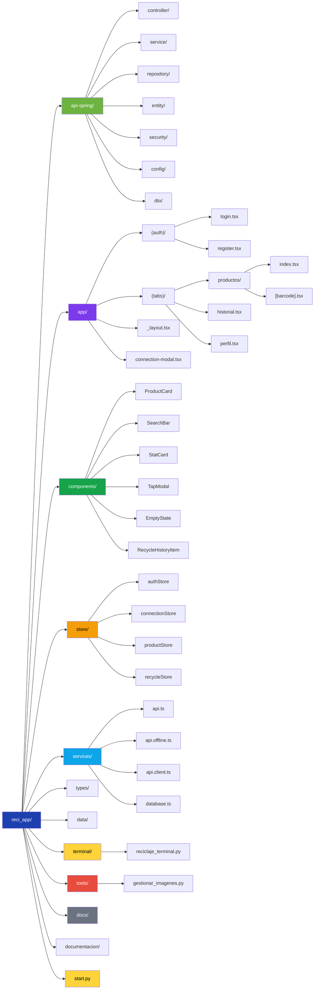
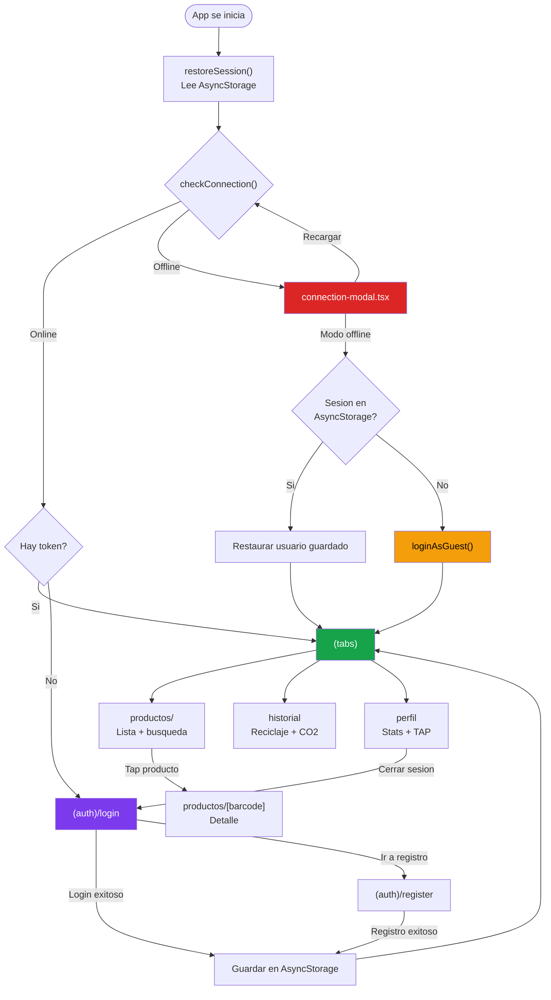

# Estructura Completa del Proyecto - ReciApp

## Repositorios Git

El proyecto se distribuye en dos repositorios independientes:

| Repositorio | Contenido | URL |
|-------------|-----------|-----|
| **Norien-hue/ReciApp** | API Spring Boot + App Movil + Terminal Python + Herramientas | github.com/Norien-hue/ReciApp |
| **Norien-hue/AplicacionInterfaces** | App Escritorio JavaFX | github.com/Norien-hue/AplicacionInterfaces |

---

## Arbol del Repo Principal (ReciApp)



## Arbol del Repo Escritorio (AplicacionInterfaces)

```
ActualAgain/
+-- app/
|   +-- src/main/java/com/javafx/
|   |   +-- model/
|   |   |   +-- Producto.java
|   |   |   +-- Transaccion.java
|   |   |   +-- Usuario.java
|   |   +-- reciWins/
|   |       +-- controllers/
|   |       |   +-- LoginController.java
|   |       |   +-- MainController.java
|   |       |   +-- SingUpController.java
|   |       |   +-- SettingsController.java
|   |       |   +-- NewProductoController.java
|   |       |   +-- ModProductoController.java
|   |       |   +-- NewUserController.java
|   |       |   +-- ModUserController.java
|   |       |   +-- NewTransaccionController.java
|   |       |   +-- ModTransaccionController.java
|   |       +-- utiles/
|   |       |   +-- ApiClient.java
|   |       |   +-- StorageSharer.java
|   |       +-- start/
|   |           +-- StartWin.java
|   +-- src/main/resources/
|       +-- view/
|       |   +-- loginStart_win.fxml
|       |   +-- singUp_win.fxml
|       |   +-- main_win.fxml
|       |   +-- settings_win.fxml
|       |   +-- changePasswd_win.fxml
|       |   +-- newProducto_win.fxml
|       |   +-- modProducto_win.fxml
|       |   +-- newUser_win.fxml
|       |   +-- modUser_win.fxml
|       |   +-- newTransaccion_win.fxml
|       |   +-- modTransaccion_win.fxml
|       |   +-- escanear_win.fxml
|       +-- configuration.properties
+-- build.gradle
```

## Estructura API Spring Boot

```
api-spring/src/main/java/com/reciapp/api/
+-- controller/
|   +-- UsuarioController.java      (login, register, profile, password, TAP)
|   +-- AdminController.java        (CRUD admin: usuarios, productos, transacciones)
|   +-- HealthController.java       (health check)
+-- service/
|   +-- UsuarioService.java         (logica de autenticacion y perfil)
|   +-- ProductoService.java        (logica de productos)
|   +-- ReciclaService.java         (logica de reciclaje)
|   +-- AdminService.java           (operaciones de administracion)
+-- entity/
|   +-- Usuario.java                (JPA @Entity -> tabla Usuarios)
|   +-- Producto.java               (JPA @Entity -> tabla Productos)
|   +-- ProductoId.java             (@EmbeddedId clave compuesta)
|   +-- Recicla.java                (JPA @Entity -> tabla Recicla)
|   +-- ReciclaId.java              (@EmbeddedId clave compuesta)
+-- repository/
|   +-- UsuarioRepository.java      (extends JpaRepository)
|   +-- ProductoRepository.java     (extends JpaRepository)
|   +-- ReciclaRepository.java      (extends JpaRepository)
+-- security/
|   +-- JwtService.java             (generacion y validacion JWT)
|   +-- JwtAuthFilter.java          (filtro Spring Security)
+-- config/
|   +-- SecurityConfig.java         (CORS, rutas publicas/protegidas/admin)
+-- dto/
    +-- LoginRequest.java
    +-- AuthResponse.java
    +-- UsuarioDto.java
    +-- ProductoDto.java
    +-- HistorialDto.java
```

## Flujo de navegacion - App Movil



## Archivos clave

### API
- `SecurityConfig.java` — Rutas publicas, autenticadas y admin; CORS; JWT filter
- `JwtAuthFilter.java` — Intercepta peticiones, valida Bearer token, establece SecurityContext
- `AdminService.java` — CRUD de usuarios/productos/transacciones, actualizacion de emisiones

### App Movil
- `services/api.client.ts` — Cliente HTTP real contra Spring Boot (JWT, endpoints)
- `services/api.offline.ts` — Modo offline con AsyncStorage + datos mock
- `services/database.ts` — Wrapper sobre RealApiService con respuestas `{ success, data, error }`
- `store/authStore.ts` — Login, registro, logout, restauracion de sesion
- `app/_layout.tsx` — Auth guard + comprobacion de conexion + PaperProvider

### App Escritorio
- `ApiClient.java` — Singleton, HttpClient Java 11+, JWT, todos los endpoints
- `StorageSharer.java` — Datos compartidos entre ventanas
- `MainController.java` — Dashboard principal (pestanas info personal, admin CRUD)
- `StartWin.java` — Lanzador de ventanas FXML

### Terminal Python
- `reciclaje_terminal.py` — Clase ReciAppTerminal con login, buscar producto/usuario, registrar reciclaje
- `start.py` — Orquestador: arranca API (WSL/EC2) + Expo Metro
- `gestionar_imagenes.py` — Subida/eliminacion de imagenes Base64 en MySQL
