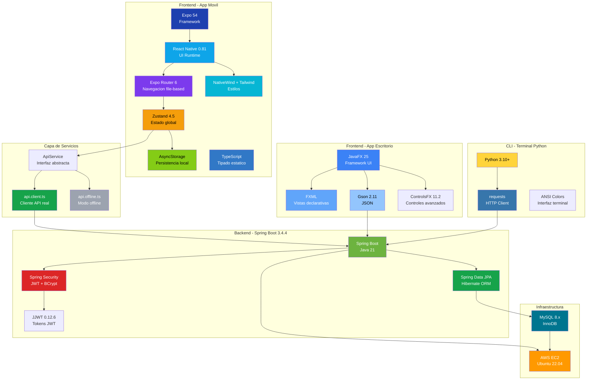

# Stack Tecnologico - ReciApp

## Dependencias principales

### Backend (Spring Boot)
| Tecnologia | Version | Uso |
|-----------|---------|-----|
| Java | 21 (LTS) | Lenguaje del backend |
| Spring Boot | 3.4.4 | Framework web |
| Spring Security | 6.x | Autenticacion JWT + BCrypt |
| Spring Data JPA | 3.x | ORM y acceso a BD |
| JJWT | 0.12.6 | Generacion/validacion JWT |
| Lombok | 1.18.x | Reduccion de boilerplate |
| MySQL Connector | 8.x | Driver JDBC |
| Gradle | 8.12 | Build tool |

### App Movil (React Native)
| Tecnologia | Version | Uso |
|-----------|---------|-----|
| React Native | 0.81.5 | Renderizado nativo |
| Expo SDK | 54 | Plataforma de desarrollo |
| Expo Router | 6.0.10 | Navegacion file-based |
| TypeScript | 5.x | Tipado estatico |
| NativeWind | latest | TailwindCSS para RN |
| Zustand | 4.5.1 | Estado global |
| AsyncStorage | 2.2.0 | Cache local |
| Reanimated | 4.1.1 | Animaciones nativas |

### App Escritorio (JavaFX)
| Tecnologia | Version | Uso |
|-----------|---------|-----|
| Java | 24 | Lenguaje de la app |
| JavaFX | 25 | Framework UI |
| Gson | 2.11.0 | JSON |
| ControlsFX | 11.2.2 | Controles avanzados |
| BCrypt (favre) | 0.10.2 | Hashing |

### Terminal Python
| Tecnologia | Version | Uso |
|-----------|---------|-----|
| Python | 3.10+ | Lenguaje de scripting |
| requests | 2.x | Cliente HTTP |
| mysql-connector | 8.x | Acceso directo MySQL (imagenes) |
| reportlab | latest | Generacion PDF documentacion |

### Distribucion e Instaladores
| Tecnologia | Version | Uso |
|-----------|---------|-----|
| jpackage (JDK 24) | -- | Genera app-image y delega en WiX para crear instaladores .exe/.msi |
| WiX Toolset | 3.14 | Compila los instaladores Windows (.exe con wizard grafico y .msi) |
| badass-runtime-plugin | 1.13.1 | Plugin Gradle que orquesta jlink + jpackage |
| Expo Prebuild + Gradle | 8.14 | Compila APK Android desde proyecto Expo |
| Android NDK | 27.1 | Compilacion nativa C++ para React Native |
| CMake | 3.22.1 | Build system para modulos nativos Android |

### Infraestructura
| Tecnologia | Version | Uso |
|-----------|---------|-----|
| AWS EC2 | t2.micro | Servidor cloud |
| Ubuntu | 22.04 LTS | Sistema operativo |
| MySQL | 8.x | Base de datos |
| Git + GitHub | -- | Control de versiones (2 repos) |
